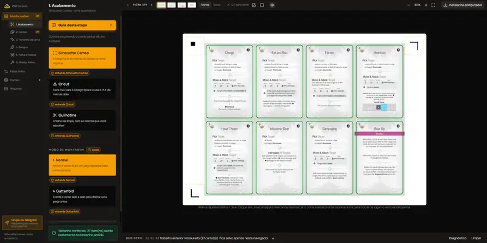
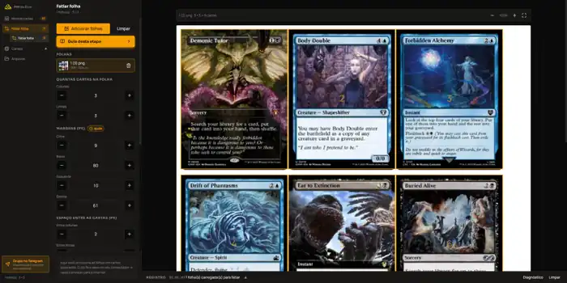

# PNP do Eron

Ferramenta web para preparar projetos **Print & Play** para impressão, montagem e corte de cartas, com suporte a fluxos manuais, Silhouette Cameo e Cricut.

**🌐 Versão online:** [pnp.eron.dev.br](https://pnp.eron.dev.br/)

## Interface

### Montar cartas

Montagem de folhas, frente e verso, sangria, gutterfold, marcas e preparação para corte.



### Fatiar folha

Separação de folhas prontas em cartas individuais, com controle de grade, margens, formato e resolução de saída.



## O que o projeto faz

- Abre e processa PDFs e imagens localmente no navegador.
- Monta cartas em folhas de impressão com frente e verso.
- Gera e controla sangria quando a arte não possui margem suficiente para o corte.
- Oferece organização guiada da folha nos modos Seguro, Econômico e Cartas coladas, além de ajustes personalizados.
- Suporta gutterfold carta por carta e gutterfold com dobra da folha inteira.
- Escolhe automaticamente a melhor direção da dobra ou permite forçar dobra horizontal ou vertical.
- Gera marcas e arquivos de corte para Guilhotina, Silhouette Cameo e Cricut.
- Permite posicionar as marcas de registro da Silhouette na frente ou no verso.
- Exporta PDFs e vetores de corte em SVG/DXF.
- Fatiar folha aceita PDF, PNG e JPG e exporta cartas em PNG ou JPG a 150, 300 ou 600 DPI.
- Possui conferência de tamanho e avisos antes de gerar arquivos com configurações potencialmente problemáticas.
- Salva o trabalho de montagem no navegador.
- Pode ser instalado como PWA.

Veja o histórico detalhado em [`CHANGELOG.md`](CHANGELOG.md).

## Gutterfold

O projeto oferece dois formatos de dobra:

- **Carta por carta:** cada carta vira uma peça aberta com frente e verso na mesma folha.
- **Dobrar a folha inteira:** as frentes ficam em uma metade da folha e os versos correspondentes na outra, prontos para uma única dobra antes do corte.

Na dobra da folha inteira, a direção pode ser automática, horizontal ou vertical. A opção automática escolhe o arranjo que comporta mais cartas. A linha de dobra é apenas uma referência de montagem e não faz parte dos vetores de corte.

## Organização e sangria

A organização da folha pode ser escolhida de forma guiada:

| Modo | Comportamento |
| --- | --- |
| **Seguro** | preserva a margem completa de cada carta |
| **Econômico** | compartilha a faixa segura para aproveitar melhor a folha |
| **Cartas coladas** | posiciona cartas na divisa, sem margem entre vizinhas |
| **Personalizado** | libera os controles avançados de distância, compartilhamento e grade |

A interface bloqueia configurações incompatíveis e informa o motivo, evitando combinações que não têm efeito no resultado final.

## Fatiar folha

O fatiador recebe **PDF, PNG ou JPG**. Ao importar um PDF, cada página entra como uma folha separada.

As cartas recortadas podem ser baixadas em:

- PNG ou JPG;
- 150, 300 ou 600 DPI;
- ZIP com as cartas organizadas para uso posterior.

## Silhouette Cameo

O fluxo da Silhouette usa o `PNP Cameo Bridge`, localizado em `local-bridge/`, para comunicar o navegador com a máquina pelo driver USBPRINT do Windows.

As marcas do sensor podem ser impressas na frente ou no verso. Quando o verso é utilizado, a geometria de corte é ajustada para acompanhar corretamente a orientação da folha.

O bridge escuta somente em `127.0.0.1` e recebe dados estruturados de corte. Ele não recebe PDFs, imagens ou pixels das cartas.

Consulte [`local-bridge/README.md`](local-bridge/README.md) para detalhes de instalação e uso.

## Privacidade

PDFs, imagens, previews e conteúdo das cartas são processados localmente no navegador. O fluxo principal foi desenhado para que esses arquivos não precisem ser enviados a servidores externos.

## Stack

- React 19
- TypeScript
- TanStack Start e TanStack Router
- Vite
- Tailwind CSS
- Nitro
- pdf-lib e PDF.js
- JSZip
- Python no PNP Cameo Bridge

## Desenvolvimento

Requisitos:

- Bun
- Git
- Python 3, apenas para desenvolvimento e uso do bridge local da Silhouette

```bash
git clone https://github.com/eronGreco/pnp-do-eron.git
cd pnp-do-eron
bun install
bun run dev
```

### Scripts

```bash
bun run dev
bun run build
bun run test
bun run typecheck
bun run lint
```

## Contribuindo

Contribuições são bem-vindas. O fluxo recomendado é:

1. Faça um fork.
2. Crie uma branch para sua alteração.
3. Rode os testes, o typecheck e o build localmente.
4. Abra um Pull Request descrevendo claramente o problema e a solução.

Leia também [`CONTRIBUTING.md`](CONTRIBUTING.md). Pull Requests passam por CI antes de serem considerados para integração na versão publicada.

## Segurança e privacidade

Mudanças que façam PDFs, imagens ou previews saírem do computador do usuário devem ter finalidade explícita, consentimento claro e documentação correspondente.

## Licença

MIT. Consulte [`LICENSE`](LICENSE).
