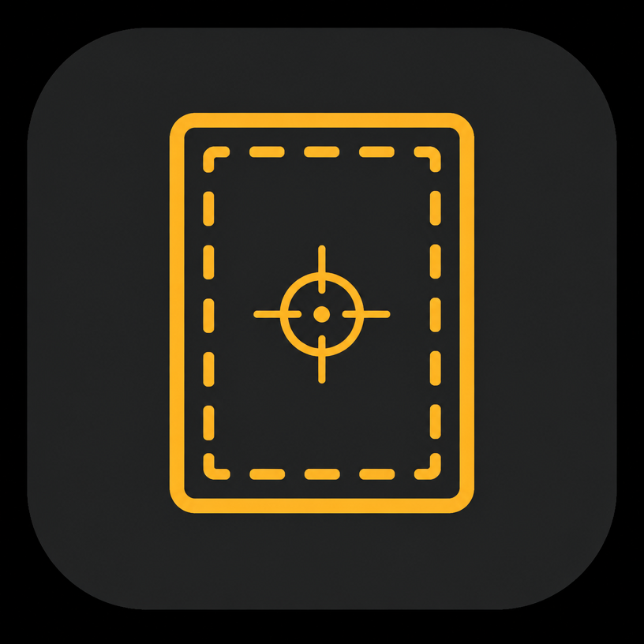
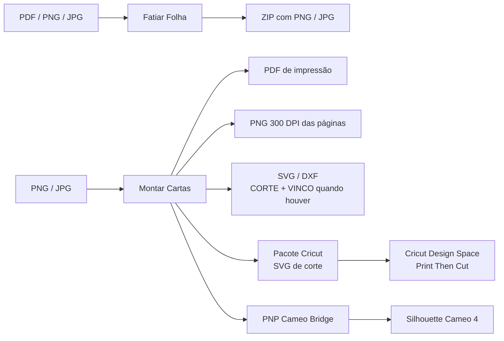
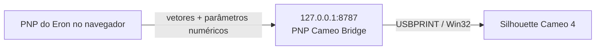

<div align="center">
  
  <h1>PNP do Eron</h1>
  <h3>Do arquivo bruto ao baralho pronto para imprimir, montar e cortar.</h3>
  <p>
    Uma estação de trabalho <strong>Print & Play</strong> focada em cartas, frente e verso,
    sangria, organização de páginas, gutterfold, fatiamento de folhas e corte com Silhouette Cameo, Cricut ou guilhotina.
  </p>
  <p>
    <a href="https://pnp.eron.dev.br/">
      
    </a>
    <a href="https://github.com/eronGreco/pnp-do-eron/actions/workflows/ci.yml">
      
    </a>
    <a href="LICENSE">
      
    </a>
  </p>
  <p>
    
    
    
    
  </p>
</div>

> [!IMPORTANT]
> **Privacidade por padrão:** PDFs, imagens, previews e artes das cartas são processados localmente no navegador. O `PNP Cameo Bridge` não recebe esses arquivos. Ele recebe apenas geometria numérica e parâmetros de corte para conversar com a Silhouette pela própria máquina do usuário.

## O que é o PNP do Eron?

Preparar um jogo Print & Play costuma exigir vários programas diferentes: um para recortar cartas de um PDF, outro para montar folhas, outro para criar sangria, mais algum ajuste manual para alinhar frente e verso e, por fim, o software da plotter de corte.

O **PNP do Eron** concentra esse fluxo em uma única estação de trabalho. Ele foi pensado para quem produz cartas em casa e quer sair de **PDFs ou imagens** até um arquivo pronto para impressão e corte, sem mandar o conteúdo das cartas para uma nuvem.

| 🃏 **Montar Cartas** | ✂️ **Fatiar Folha** | 🖨️ **Cortar no PNP** |
| --- | --- | --- |
| Organiza frentes e versos, cria sangria, monta folhas, controla a ordem das páginas e gera PDF, PNGs e vetores de corte. | Recupera cartas individuais de PDFs e imagens de folhas prontas. | Envia a geometria de corte para uma Silhouette Cameo 4 por meio de um bridge local no Windows. |

## Interface

<table>
  <tr>
    <td width="50%" align="center"><strong>🃏 Montar Cartas</strong></td>
    <td width="50%" align="center"><strong>✂️ Fatiar Folha</strong></td>
  </tr>
  <tr>
    <td></td>
    <td></td>
  </tr>
</table>

## Fluxo do projeto



## Funcionalidades

<details open>
<summary><strong>🃏 Montar Cartas (Composer)</strong></summary>

<br>

O Composer é o coração do projeto. Ele prepara baralhos e folhas de impressão com controle fino sobre dimensões, sangria, frente, verso, dobra, ordem das páginas e acabamento.

### Imagens e frente/verso

- Importação de **PNG e JPG**.
- Modo em pares: os arquivos entram como **frente + verso** da mesma carta.
- Modo com **verso comum**: todas as frentes usam a mesma imagem de verso.
- Uma carta pode substituir o verso comum por um **verso próprio**.
- Reordenação das cartas por arrastar e soltar.
- O trabalho é persistido localmente no navegador.

### Tamanho das cartas

O projeto inclui presets usados no mercado de jogos de tabuleiro e também aceita medidas personalizadas.

| Preset | Medidas |
| --- | ---: |
| Mini USA | 41 × 63 mm |
| Mini Euro | 45 × 68 mm |
| Standard USA | 56 × 87 mm |
| Standard American | 57 × 89 mm |
| Bridge | 57 × 89 mm |
| Euro / Poker | 63,5 × 88 mm |
| Magnum Space | 61 × 103 mm |
| Tarot | 70 × 120 mm |
| Quadrada pequena | 52 × 52 mm |
| Quadrada grande | 70 × 70 mm |

### Folhas

- **A4**, **A3** e **A5**.
- **Carta (279 × 216 mm)** e **Ofício (356 × 216 mm)**.
- **Polaseal A4 (220 × 307 mm)** para projetos plastificados antes do corte; em Paisagem ele usa **307 × 220 mm** e em Retrato **220 × 307 mm**.
- Folha **personalizada**, entre 50 e 1000 mm por lado.
- Orientação paisagem ou retrato quando compatível com o acabamento escolhido.
- Em folhas personalizadas, largura e altura são respeitadas exatamente como digitadas.

> ℹ️ **Nota — Silhouette Cameo:** o corte direto pelo PNP Cameo Bridge permanece fisicamente validado em **A4 paisagem**. Outros formatos que cabem na largura da máquina podem aparecer como experimentais na montagem; A3 e Ofício permanecem bloqueados no modo Cameo.

### Organização inteligente

| Modo | O que faz |
| --- | --- |
| 🛡️ **Seguro** | preserva toda a margem de cada carta |
| ↔️ **Econômico** | compartilha a faixa segura para aproveitar melhor a folha |
| 🧩 **Cartas coladas** | corta na divisa entre vizinhas e usa sangria apenas no contorno externo do conjunto |
| 🎛️ **Personalizado** | libera distância, compartilhamento de margem e grade manual |

O sistema calcula automaticamente quantas cartas cabem na folha, respeita áreas bloqueadas pelas marcas de registro e impede que o corte final invada zonas críticas.

No modo **Cartas coladas**, as cartas continuam encostadas e as divisões internas permanecem com **0 mm** de sangria. A medida configurada é usada somente no perímetro externo do conjunto, limitada pela borda da folha, evitando que a arte de uma carta cubra a vizinha.

### Sangria

A sangria pode ser criada localmente mesmo quando a arte original não possui sobra para corte. Os métodos disponíveis incluem:

- **esticar** a borda;
- **espelhar** a borda;
- preencher com **cor média** da borda ou uma cor escolhida;
- **esticar + desfoque**;
- aparar uma faixa existente antes de gerar a nova sangria.

Frente e verso possuem controles independentes. A geometria de cada carta é isolada para que a sangria de uma arte não invada o conteúdo da vizinha. Em **Cartas coladas**, essa proteção também vale nas divisas internas, enquanto a sangria pedida continua disponível no contorno externo da montagem.

### Gutterfold

O modo gutterfold foi feito para projetos em que frente e verso são unidos dobrando o papel.

- **Carta por carta:** cada carta vira uma peça aberta com frente, canaleta e verso.
- **Folha inteira:** as cartas ficam distribuídas em duas metades da folha para uma única dobra antes do corte.
- Direção da dobra **automática, horizontal ou vertical**.
- Na montagem carta por carta, a dobra vertical mantém frente e verso lado a lado; a horizontal coloca a frente em cima e o verso embaixo, girado em **180°**.
- Em Automática, o sistema escolhe a direção que comporta mais peças; no empate da montagem carta por carta, preserva a dobra vertical.
- Canaleta configurável, incluindo **0 mm** para encostar as duas faces exatamente na dobra.
- Rotação automática do verso quando necessária para que a arte alinhe após dobrar.
- Nos exportadores genéricos, a dobra sai separada na camada **VINCO** e o contorno na camada **CORTE**.
- O **VINCO não é enviado** ao corte direto da Cameo nem ao Pacote Cricut usado para gerar o Print Then Cut.

### Acabamento

A etapa de acabamento separa primeiro o corte manual do corte por máquina:

1. **GUILHOTINA** para corte manual com marcas impressas.
2. **SILHOUETTE** para o fluxo por máquina; ao selecionar essa opção aparecem as subopções **CAMEO** e **CRICUT**.

Essa hierarquia é apenas de interface. Internamente, os fluxos continuam independentes: Cameo usa as marcas ópticas e o PNP Cameo Bridge; Cricut usa SVG + Design Space + Print Then Cut.

### Montagem final, ordem das páginas e imagens da folha

O PDF final pode ser organizado de quatro formas:

- **Frente e verso intercalados**;
- **Somente frentes**;
- **Somente versos**;
- **Todas as frentes, depois os versos**.

O modo intercalado permanece como padrão. Quando não existe arte de verso efetiva, páginas de verso inúteis deixam de ser geradas; um **verso comum** continua contando como verso real. Quando apenas algumas folhas precisam de verso, o sistema preserva as páginas em branco necessárias para manter o pareamento correto na impressão.

A prévia e a receita de corte acompanham a ordem final das páginas, inclusive quando um dos lados é omitido. O sistema também avisa quando a organização escolhida exclui o lado onde estão as marcas de corte.

Depois da montagem, as páginas podem ser salvas como **PNG em 300 DPI**. Um PDF de uma página gera um PNG direto; múltiplas páginas geram um ZIP com nomes que indicam página, folha e lado.
### Acabamento e exportação

| Fluxo | Saída / comportamento |
| --- | --- |
| **Guilhotina / régua / estilete** | marcas e guias para corte manual |
| **Silhouette Cameo** | marcas de registro, vetores de corte e opção de corte direto pelo bridge local |
| **Cricut** | Pacote Cricut em SVG para o Design Space + importação do PDF com marcas Print Then Cut |
| **Vetores genéricos** | SVG e DXF com **CORTE** e, em gutterfold, **VINCO** separado |
| **Impressão** | PDF final com organização configurável de frentes e versos |
| **Imagem** | páginas montadas em PNG 300 DPI, com ZIP quando houver várias páginas |

No fluxo Cricut, apenas o **SVG de corte** precisa ir para o Design Space. As imagens das cartas permanecem no PNP do Eron.

- O SVG usa uma âncora de escala do tamanho da folha para preservar a dimensão física na importação pelo Design Space.
- Essa âncora fica na camada **`APAGAR-ANTES-DO-PRINT-THEN-CUT`**, com o objeto **`folha-referencia-tamanho`**, e deve ser apagada ou ocultada antes de anexar ou transformar o desenho em Print Then Cut. Os contornos das cartas permanecem.
- A combinação validada para preservar escala usa pixels calculados a **72 DPI** e SVG sem `viewBox` no Pacote Cricut.
- O PDF devolvido pelo Design Space é analisado para localizar as marcas e a área ocupada pelo desenho, mantendo o alinhamento com a posição real das cartas.
- O detector procura a geometria coerente das marcas em L mesmo quando elas não estão próximas dos cantos físicos da folha e mantém compatibilidade com o leitor legado.
- O preflight usa limites conhecidos do Print Then Cut para eliminar arranjos obviamente grandes demais: **A4 183 × 269,8 mm**, **Carta 189 × 252,5 mm**, **Ofício 189 × 328,7 mm** e **A3 270 × 392 mm**.
- Esses eixos são fixos no Design Space e **não trocam com a orientação da folha**. Em A4, por exemplo, cartas poker de 63,5 × 88,9 mm ficam em no máximo **2 × 3** no Retrato; em Paisagem, três cartas lado a lado ultrapassariam o limite horizontal de 183 mm.
- A área real do Print Then Cut tem cantos irregulares, então o Design Space continua sendo a validação final. Formatos sem limite conhecido não recebem uma medida inventada.
- Na Cameo, o braço em L das marcas usa **10 mm por padrão**. Há um ajuste experimental entre 10 e 20 mm que altera somente o comprimento do braço e o comando correspondente de registration.

### Auditoria antes do download

A montagem é conferida antes da geração final. O sistema verifica situações como cartas fora da folha, conteúdo atingindo marcas de sensor, limites conhecidos do Print Then Cut e configurações que podem gerar impressão incorreta. Se o usuário insistir em uma montagem de risco, o download exige uma confirmação explícita.

</details>

<details open>
<summary><strong>✂️ Fatiar Folha (Slicer)</strong></summary>

<br>

O Slicer faz o caminho inverso: recebe uma folha pronta e recupera cada carta como uma imagem individual.

- Entrada por **PDF, PNG ou JPG**.
- PDFs com múltiplas páginas são abertos página por página.
- Cada página de PDF é renderizada localmente em **300 DPI** antes do recorte.
- Grade configurável por **linhas e colunas**.
- Ajuste de margens superior, inferior, esquerda e direita.
- Espaçamento horizontal e vertical entre cartas.
- Tratamento de cantos para reduzir bordas brancas em cartas arredondadas.
- Exportação em **PNG ou JPG**.
- Saída em **150, 300 ou 600 DPI**.
- Download em **ZIP** com as cartas recortadas.

O processamento usa Canvas e, quando disponível, `OffscreenCanvas`, mantendo os bytes dos arquivos dentro do navegador.

</details>

<details open>
<summary><strong>🖨️ Cortar no PNP + PNP Cameo Bridge</strong></summary>

<br>

Navegadores não podem controlar diretamente uma Silhouette conectada por USB. Para resolver isso sem entregar arquivos a um servidor externo, o projeto usa um pequeno serviço local para Windows: o **PNP Cameo Bridge**.



### O que o bridge recebe

Somente dados estruturados de corte, como:

```json
{
  "sheet": 1,
  "cards": [
    { "x0Mm": 20, "y0Mm": 20, "x1Mm": 72, "y1Mm": 72 }
  ],
  "settings": {
    "depth": 4,
    "force": 18,
    "speed": 2,
    "passes": 1,
    "radiusMm": 3,
    "lineOvercut": false
  }
}
```

Ele **não recebe PDF, imagem, pixels, caminho de arquivo ou comando arbitrário de sistema**.

### Segurança do bridge

- Escuta somente em `127.0.0.1:8787`.
- CORS restrito às origens oficiais do app.
- Token de sessão novo a cada execução.
- Um trabalho físico por vez.
- Validação dos valores antes de qualquer acesso ao equipamento.
- Acesso à plotter pelo driver nativo **USBPRINT** do Windows.
- Sem Zadig, libusb, PyUSB, WinUSB ou troca de driver.

### Protocolo da Cameo 4

O protocolo atualmente validado usa:

- `CreateFileW` em modo exclusivo com `FILE_FLAG_OVERLAPPED`;
- leitura persistente do status `ESC ENQ`;
- rotina de registration pelas marcas ópticas;
- confirmação de registration antes da lâmina entrar em ação;
- AutoBlade no holder 1;
- conversão de **1 mm = 20 unidades da máquina**;
- retorno à origem e confirmação de `READY` ao terminar.

Os detalhes de baixo nível, tempos, comandos congelados e validações físicas ficam documentados em [`local-bridge/README.md`](local-bridge/README.md).

</details>

## Privacidade e arquitetura local

O projeto segue uma regra simples: **o conteúdo do jogo pertence ao usuário e deve continuar na máquina dele**.

```text
PDF / imagens
     │
     ▼
┌──────────────────────────────┐
│ Navegador                    │
│ PDF.js · Canvas · pdf-lib    │
│ montagem · sangria · slicer  │
└──────────────────────────────┘
     │
     ├── PDF / PNG / JPG / ZIP / SVG / DXF -> download local
     │
     ├── SVG de corte -> Design Space (somente no fluxo Cricut)
     │
     └── somente geometria de corte
                    │
                    ▼
          PNP Cameo Bridge
          127.0.0.1:8787
                    │
                    ▼
          USBPRINT -> Cameo 4
```

No fluxo Cricut, o arquivo enviado ao Design Space contém **somente geometria de corte**; as artes das cartas continuam locais.

> [!TIP]
> O aplicativo também funciona como **PWA instalável**. O Service Worker mantém os recursos da aplicação em cache para deixar o uso mais próximo de um programa de desktop.

## Começando

### Usar sem instalar

1. Abra **[pnp.eron.dev.br](https://pnp.eron.dev.br/)**.
2. Escolha **Montar Cartas** ou **Fatiar Folha**.
3. Importe seus arquivos.
4. Configure tamanho, folha, sangria e acabamento.
5. Gere o PDF, as imagens das páginas ou os vetores de corte.

Para corte direto na Silhouette Cameo 4, execute também o `PNP Cameo Bridge` no Windows. O ZIP distribuído pelo projeto está em [`public/downloads/PNP-Cameo-Bridge.zip`](public/downloads/PNP-Cameo-Bridge.zip).

### Rodar localmente

Requisitos:

- [Bun](https://bun.sh/)
- Git
- Python 3.9+ apenas para o PNP Cameo Bridge

```bash
git clone https://github.com/eronGreco/pnp-do-eron.git
cd pnp-do-eron
bun install
bun run dev
```

### Scripts

```bash
bun run dev        # desenvolvimento
bun run build      # build de produção
bun run test       # testes automatizados
bun run typecheck  # TypeScript
bun run lint       # ESLint
```

## Stack

<div align="center">
  
  
  
  
  
  
</div>

Principais peças:

- **React 19 + TypeScript** para a aplicação.
- **TanStack Start / Router** para estrutura e roteamento.
- **Tailwind CSS v4 + Radix UI** para interface.
- **pdf-lib + PDF.js** para leitura e geração de PDFs.
- **Canvas / OffscreenCanvas** para processamento de imagem.
- **JSZip** para pacotes do fatiador, Pacote Cricut e exportações com múltiplos arquivos.
- **Service Worker / PWA** para instalação e cache da aplicação.
- **Python 3 + ctypes / Win32** no bridge da Silhouette.

## Estrutura principal

```text
src/
├── composer/        montagem de folhas, ordem de páginas, grade, gutterfold e PDF
├── slicer/          fatiamento de PDF e imagens
├── bleed/           detecção e geração de sangria
├── cameo/           geometria e dados de corte da Silhouette
├── cricut/          detecção de marcas e fluxo Print Then Cut
├── cut/             marcas e geometria comum de corte
├── export/          SVG, DXF, Pacote Cricut e vetores de corte
├── pdf/             leitura, manifesto e geração de PDF
├── pwa/             registro do Service Worker
└── components/      interface e painéis da aplicação

local-bridge/
├── bridge.py              servidor HTTP local
├── usbprint.py            comunicação USBPRINT / Win32
├── persistent_reader.py   leitura persistente da plotter
├── cameo_protocol.py      registration, AutoBlade e corte
└── validation.py          validação dos trabalhos físicos
```

## Contribuindo

Contribuições são bem-vindas. Para alterações relevantes:

1. Faça um fork.
2. Crie uma branch para sua alteração.
3. Rode testes, typecheck e build.
4. Abra um Pull Request explicando o problema e a solução.

Leia [`CONTRIBUTING.md`](CONTRIBUTING.md) antes de começar. O CI do repositório executa automaticamente testes, typecheck e build em Pull Requests.

> [!WARNING]
> Mudanças que façam PDFs, imagens ou previews saírem do computador do usuário precisam ter finalidade explícita, consentimento claro e documentação correspondente.

## Histórico e documentação

- 📝 [`CHANGELOG.md`](CHANGELOG.md): mudanças relevantes do projeto.
- ✂️ [`local-bridge/README.md`](local-bridge/README.md): documentação técnica do PNP Cameo Bridge.
- 🤝 [`CONTRIBUTING.md`](CONTRIBUTING.md): como contribuir.

## Licença

Distribuído sob licença **MIT**. Consulte [`LICENSE`](LICENSE).

<div align="center">
  <p><strong>PNP do Eron</strong></p>
  <p>Feito para quem prefere gastar tempo jogando e criando, não brigando com PDF, sangria e marca de corte. 🎲✂️</p>
  <a href="https://pnp.eron.dev.br/">Abrir o app</a>
  ·
  <a href="CHANGELOG.md">Ver changelog</a>
  ·
  <a href="https://github.com/eronGreco/pnp-do-eron/issues">Issues</a>
</div>